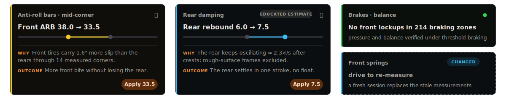
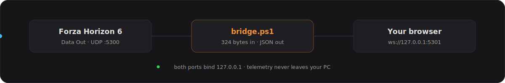

<div align="center">

<a href="https://tautellini.github.io/ForzaTuningAdvisor/">
  
</a>

<br><br>

[](https://tautellini.github.io/ForzaTuningAdvisor/)


<sub>No account, no install, nothing uploaded. The page talks only to a tiny bridge on your own PC.</sub>

</div>

<br>

Drive for a few minutes. The advisor reads the telemetry stream Forza Horizon 6 already broadcasts, measures what the car actually does (slip angles, body roll, lockups, wheelspin, the power curve) and turns the symptoms into setup changes: which lever, which direction, and, once you have entered your tuning sheet, the exact value with a one-click **Apply**.

<div align="center">
  
  <br>
  <sub>The card states: a measured change with one-click Apply &nbsp;·&nbsp; a noisier signal, flagged honestly &nbsp;·&nbsp; a verified lever &nbsp;·&nbsp; a lever you just edited (advice pauses until fresh driving re-measures it)</sub>
</div>

## Why this exists

There is no shortage of shared tunes, in game and online. But most of what you find is leaderboard meta: anti-roll bars at 1/1, springs on the minimum stop, ride height maxed, tire pressures far outside any sane window. Built to win a speed trap, miserable to race through corners with an A700, S1 or S2 build.

Most of the rest are generic guide values, the same numbers recommended for every car regardless of weight, drivetrain or balance. Unless you already have a trusted source, a tune that respects the actual car is hard to come by. And Forza itself does not help you learn: shared tunes are locked to their creator, so you cannot even look inside the good ones.

This tool attacks the gap from the other side. Instead of copying someone's idea of what is "intended to be good", it measures what your car actually does, with your build, on your surface, and points at the lever that fixes it. Measured data does not lie and has no opinion.

It is still a game, and the telemetry is not a perfect picture of real car behavior. Treat the advice as a well-founded indicator of the right direction, backed by evidence you can see, not as a lap-time guarantee.

## How it works

Browsers cannot receive UDP, so one small script does the only thing the page can't:

<div align="center">
  
</div>

- **`bridge.ps1`** is ~200 lines of readable PowerShell. No install, no admin rights, nothing compiled: it parses Forza's 324-byte packets and forwards them as JSON over a local WebSocket. That is all it does; every bit of analysis runs in your browser.
- **The web app** is a static React + Vite site on GitHub Pages. It stores everything in your browser and never phones home.
- Nothing modifies the game. The bridge only listens to the telemetry feed Forza itself offers.

## Two minutes to first advice

| 1 · Telemetry on | 2 · Run the bridge | 3 · Drive |
|---|---|---|
| In Forza: **Settings → HUD &amp; Gameplay → Data Out**. Set IP `127.0.0.1` and port `5300`. | Download `bridge.ps1` from the [app's start page](https://tautellini.github.io/ForzaTuningAdvisor/), then run it: `powershell -ExecutionPolicy Bypass -File .\bridge.ps1` (or right-click → *Run with PowerShell*). | Open the [app](https://tautellini.github.io/ForzaTuningAdvisor/). It connects on its own and switches to the live dashboard. Coverage bars show which measurements are still missing. |

## What it measures, what it advises

The tune sheet *is* the advice display: every lever of the in-game tuning menu is an editable row, and advice lands directly on the lever it wants to move.

| Group | Read from telemetry | Typical card |
|---|---|---|
| Tires | temperatures, plus the discipline's pressure window | running hot, pressures outside the window for the surface |
| Gearing | your measured power curve, time on the limiter | optimal shift rpm per gear, top gear too short, ratio spacing |
| Alignment | body roll, straight-line scrub | camber that keeps the loaded tire flat, toe from scrub, caster floor |
| Anti-roll bars | front vs rear slip, split by corner phase | soften the front bar for mid-corner understeer |
| Springs | dive, squat, bottoming-out | rates and ride height against pitch and bottoming |
| Damping | oscillation after crests, top-out, bump:rebound ratio | rebound and bump steps per axle |
| Aero | grip at high vs low speed | add or trim downforce, shift the front/rear split |
| Brakes | lockup events, full vs partial | pressure problems separated from balance problems |
| Differential | wheelspin on exit, lift-off snap, center split | accel/decel lock percentages, center balance |

The engine is built to be trustworthy rather than chatty:

- **It sees symptoms, never your tune.** With your sheet entered it computes exact targets and Apply writes them; without it you still get the direction and the reason.
- **Evidence gates.** No rule fires off a single corner. Each one needs about 30 seconds of relevant driving, and kerb or rough-surface frames are excluded from suspension metrics.
- **Confidence is explicit.** Noisy inferences carry an *educated estimate* chip instead of pretending to be measurements.
- **Edited levers go stale.** Change a value and its advice pauses ("drive to re-measure") until a fresh session has measured the new setup, so you never chase your own edits.

## Five disciplines

Road, Dirt (rally), Offroad (cross country), Drift and Drag each run their own rule set, thresholds and tire-pressure windows; an offroad build wants far lower pressures than a road build, and the advisor knows that. Drift scores rotation instead of "fixing" oversteer; Drag drops cornering balance entirely and judges launch and aero drag.

## A garage that remembers

- Every car gets its own workspace, recognized automatically from telemetry. Switching cars in the game closes the running session cleanly and asks before changing your view.
- Sessions are stored as compact statistics, never raw frames. Recent sessions form the evidence pool behind every card.
- Tunes can be archived as named setups per car and restored later.
- Export a setup, a car or the whole garage as a file. Import merges and never overwrites; everything lives in your browser's IndexedDB.

Also in the box: a measured power-curve chart, per-area coverage bars, a docked live telemetry bar and metric/imperial display units.

## Honest limits

- FH6 sends **one temperature per tire** and no pressure or wear channels. The classic temp-spread method for camber and toe is impossible with this feed, so the advisor estimates camber from body roll and toe from straight-line scrub, and validates caster and pressures against per-discipline knowledge windows instead.
- Menus and pause send zeroed packets; the advisor knows and ignores them.
- The game and the bridge must run on the same Windows PC. The bridge binds to localhost only, so console telemetry cannot reach it.

See [`Docs/forza-data-format.md`](Docs/forza-data-format.md) for the verified 324-byte FH6 packet layout, including where it differs from FH4/FH5 references.

## Develop

[](https://github.com/Tautellini/ForzaTuningAdvisor/actions/workflows/deploy-pages.yml)

```bash
cd ui
npm install
npm run dev        # http://localhost:5173, connects to ws://127.0.0.1:5301
npm run build      # strict TypeScript check + production build
```

| Path | What lives there |
|---|---|
| `ui/` | the web app; all analysis logic is client-side TypeScript (`ui/src/advice/engine.ts`) |
| `bridge/powershell/bridge.ps1` | the bridge, single source; the build copies it into the site so the app can hand it out |
| `Docs/forza-data-format.md` | the verified FH6 packet layout |
| `data/` + `scripts/build-car-db.mjs` | car identity database; regenerates `ui/public/cars.json` |

The wire contract lives in three places that must agree: `Parse-Packet` in `bridge.ps1`, the `Telemetry` interface in `ui/src/types.ts`, and the format doc. Pushes to `main` touching `ui/**` deploy to Pages automatically.

<br>

<div align="center">
  
  <br>
  <sub>Free and open source under the <a href="LICENSE">MIT license</a>.</sub>
  <br>
  <sub>Fan-made tool. Not affiliated with Playground Games, Turn 10 or Microsoft. Forza is a trademark of Microsoft.</sub>
</div>
